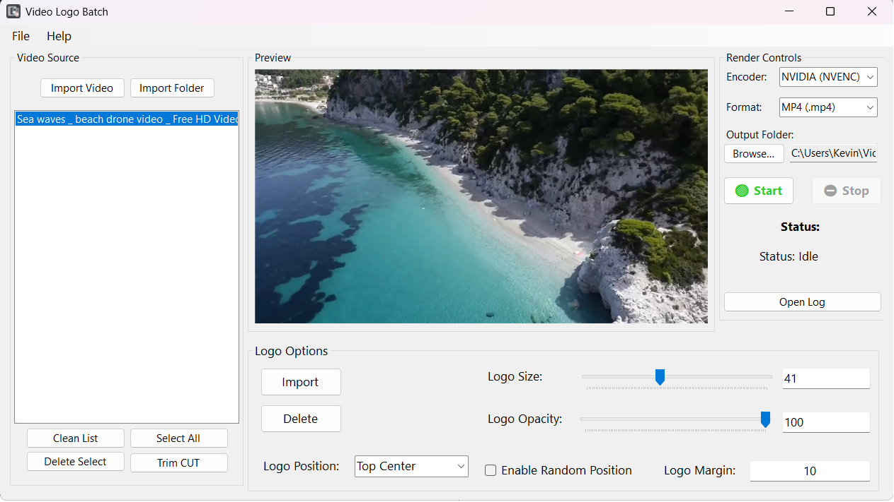
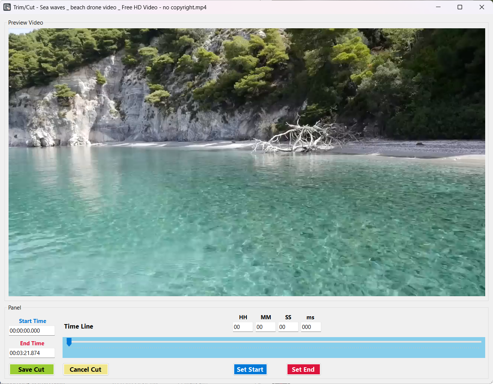

# VideoLogoBatch


**VideoLogoBatch** is a lightweight Windows desktop application for quickly and easily batch-rendering videos with a logo overlay. Built on the .NET 8 platform and the power of FFmpeg, this app provides an intuitive graphical interface to automate complex video processing tasks.

---
## 🖼️ Interface





## ✨ Key Features

-   **Batch Processing:**
    -   Add and process multiple video files simultaneously.
    -   Import all videos from an entire folder with a single click.

-   **Comprehensive Logo Customization:**
    -   **PNG Logo Overlay:** Easily add your transparent PNG logo.
    -   **Position Control:** Choose from 7 common static logo positions (Top/Bottom/Middle, Left/Right/Center).
    -   **Size Adjustment:** Scale the logo's size based on a percentage of the video's width.
    -   **Opacity Control:** Make your logo as subtle or as prominent as you like.
    -   **Margin Customization:** Set the precise padding between the logo and the video edges.

-   **Floating Logo Effect:**
    -   A unique feature that animates your logo, making it move smoothly across the screen throughout the video's duration for a dynamic and professional effect.

-   **Performance and Rendering:**
    -   🚀 **GPU Acceleration:** Automatically detects and utilizes NVIDIA (NVENC) or AMD (AMF) hardware acceleration to significantly speed up the rendering process.
    -   **Live Preview:** Instantly see how your logo will look on a video frame before committing to a full render.
    -   **Format & Encoder Options:** Full control over the output video format and the specific encoder to be used.
    -   **Cancel Task:** Easily stop an ongoing render process at any time.

-   **Utility Tools:**
    -   ✂️ **Trim/Cut Video:** An integrated tool with its own interface that allows you to accurately trim a segment from a video before processing.
    -   **Smart Output Management:**
        -   Automatically saves processed videos to a dedicated `"My Videos\VideoLogoBatch_Output"` folder for easy organization.
        -   Automatically renames files by appending a number `(1)`, `(2)`... to prevent overwriting existing files.
    -   **Detailed Logging:** Each render session generates its own log file for easy tracking and troubleshooting.

---

## ⚙️ Setup & Usage

This is a **portable** application, no complex installation is required.

1.  **Download FFmpeg:** This application requires FFmpeg to function.
    -   Visit: https://www.gyan.dev/ffmpeg/builds/
    -   Download the latest release essentials build, e.g., `ffmpeg-release-essentials.7z`.
    -   Extract the downloaded file. You will get a folder named something like `ffmpeg-7.0-essentials_build`.
    -   Rename this folder to `ffmpeg`.

2.  **Set up the folder structure:**
    -   Download the latest release of **VideoLogoBatch**.
    -   Extract the ZIP archive.
    -   Copy the `ffmpeg` folder (prepared in step 1) into the application's root directory, alongside the `VideoLogoBatch.exe` file.

    The final folder structure must look like this:
    ```
    VideoLogoBatch/
    ├── VideoLogoBatch.exe
    ├── (other .dll and .json files)
    └───ffmpeg/
        └───bin/
            ├── ffmpeg.exe
            └── ffplay.exe
    ```

3.  **Run the application:**
    -   Double-click `VideoLogoBatch.exe` to start.

---

## 📜 License

This project is licensed under the **Apache License 2.0**. See the `LICENSE.txt` file for details.

---

🌐 **GitHub:** [https://github.com/DEVCodeWithAI](https://github.com/DEVCodeWithAI)  
☕ **Support the Author:** [https://buymeacoffee.com/devcodewithai](https://buymeacoffee.com/devcodewithai)
